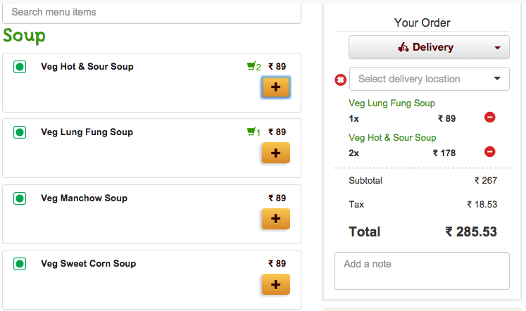

= Lab 02

[abstract]
In this lab you'll use controllers, services, loop-based directives in Angular JS.

== Application
Have a look at the screenshot below. +

*  In the left side you see the menu, which is loaded dynamically.
*  When you click the _plus_ button you add the item to the cart in the right side.
*  Compute the total automatically, when items are removed/added in the cart.

*  Implement this application with the following in mind.
*  Write your controllers/services/modules in separate _.js_ files
