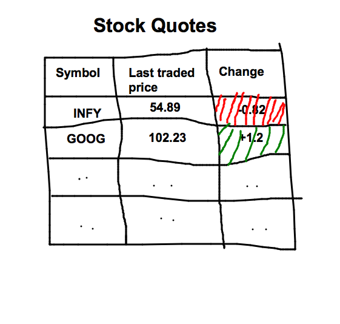

= Lab on Ajax

== Problem
* You have a collection of stock symbols in your server.
"MS", "GOOG", "INTC", "AAPL", "GM", "FB", "INFY", "HP"

* You will load the stock symbols from the server on page load and display them in a table.

* You will send AJAX requests to the following url by passing each and every symbol.

http://query.yahooapis.com/v1/public/yql?q=select%20*%20from%20yahoo.finance.quotes%20where%20symbol%20in%20(%22SYMBOL%22)%0A%09%09&env=http%3A%2F%2Fdatatables.org%2Falltables.env&format=json

*  If you replace the SYMBOL with INFY or FB you will get a JSON output. Study the JSON output by copying it to http://jsonlint.com.

* Look for
_query.results.quote.LastTradePriceOnly_ (this will give the stock price) and
_query.results.quote.Change_  (this will give the change w.r.t the previous value)

* Display these values in the table.

* If the Change is positive display the value in GREEN color and if the Change is a negative value display the value in RED color.

* Look at the sample screen shot below.

* Every 10 seconds you'll have to refresh the price. The lasttradeprice and change columns alone will be You don't have to construct the table again.

* Modify your server.js appropriately. 

* Create _Lab01.html_ and specific js files in _public_ folder.

* Refer to *$window* in Angular JS API documentation.